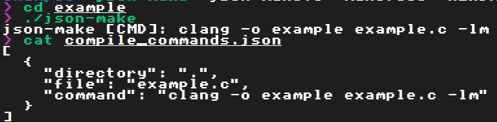

# json-make
#### ~100 LOC toy build tool that speaks the same language as your C language server



## building
json-make is currently only for \*nix, tested with Debian 11.  
The only external dependency is [json-c](http://json-c.github.io/json-c/json-c-current-release/doc/html/index.html), which most repositories should have.
```sh
sudo apt install libjson-c-dev # if you need it
make
```
and if you'd like to test it:
```sh
make run
```
and then take a loot at `example/`.
